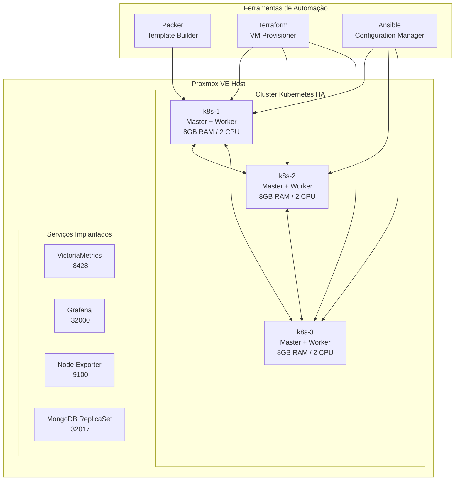

# 🚀 Desafio Woovi - Automação Completa de Cluster Kubernetes HA


## 📋 Índice

- [Visão Geral](#-visão-geral)
- [Arquitetura](#-arquitetura)
- [Pré-requisitos](#-pré-requisitos)
- [Configuração Inicial](#-configuração-inicial)
- [Execução Manual por Etapas](#-execução-manual-por-etapas)
- [Execução Automatizada](#-execução-automatizada)
- [Problemas Conhecidos](#-problemas-conhecidos)
- [Personalização](#-personalização)
- [Monitoramento](#-monitoramento)
- [Troubleshooting](#-troubleshooting)

## 🎯 Visão Geral

Este projeto implementa uma **automação completa de infraestrutura como código (IaC)** para criar um cluster Kubernetes de alta disponibilidade usando **MicroK8s** em ambiente **Proxmox VE**. A solução inclui:

- 🏗️ **Template de VM otimizado** com Packer
- 🚀 **Provisionamento automatizado** de VMs com Terraform  
- ⚙️ **Configuração de cluster HA** com Ansible
- 📊 **Stack de monitoramento** com VictoriaMetrics + Grafana
- 💾 **Banco de dados** MongoDB em ReplicaSet
- 🔐 **Segurança** por padrão com Ansible Vault

### 🏛️ Arquitetura



## 🔧 Pré-requisitos

### Infraestrutura
- **Proxmox VE** 7.0+ configurado e acessível
- **24GB RAM** disponível (3 VMs × 8GB cada)
- **150GB storage** disponível (3 VMs × 50GB cada)
- **Rede com DHCP** configurada no Proxmox

### Ferramentas Locais
```bash
# Ubuntu/Debian
sudo apt update && sudo apt install -y \
    terraform \
    ansible \
    packer \
    git \
    ssh

# Verificar versões
terraform version  # >= 1.0
ansible --version  # >= 2.9
packer version     # >= 1.7
```

### Acesso e Credenciais
- **Conta no Proxmox** com permissões de administrador
- **Par de chaves SSH** configurado
- **Token de API** do Proxmox criado

## ⚙️ Configuração Inicial

### 1. Clone do Repositório
```bash
git clone https://github.com/SEU_USUARIO/NOME_DO_REPO_PUBLICO.git
cd NOME_DO_REPO_PUBLICO
```

### 2. Configuração do Proxmox

No Proxmox, crie um token de API:
```bash
# Via web interface: Datacenter > API Tokens > Add
# Ou via CLI:
pveum user add terraform@pve --password <senha>
pveum acl modify / --users terraform@pve --roles PVEAdmin
```

### 3. Configuração de Credenciais

#### Packer (Template Builder)
```bash
# Copie o arquivo de exemplo
cp packer/credentials.pkr.hcl.example packer/credentials.pkr.hcl

# Edite com suas credenciais:
vi packer/credentials.pkr.hcl
```

**Conteúdo do `packer/credentials.pkr.hcl`:**
```hcl
# Suas credenciais do Proxmox
proxmox_api_url = "https://SEU_IP_PROXMOX:8006/api2/json"
proxmox_api_token_id = "terraform@pve!token_name"
proxmox_api_token_secret = "sua-chave-secreta-aqui"
target_node = "nome-do-seu-no-proxmox"
ssh_public_key = "ssh-rsa AAAA... usuario@hostname"
```

#### Terraform (VM Provisioner)
```bash
# Copie o arquivo de exemplo
cp terraform/sekret.tfvars.example terraform/sekret.tfvars

# Edite com suas credenciais:
vi terraform/sekret.tfvars
```

**Conteúdo do `terraform/sekret.tfvars`:**
```terraform
proxmox_api_token_id = "terraform@pve!token_name"
proxmox_api_token_secret = "sua-chave-secreta-aqui"
proxmox_api_url = "https://SEU_IP_PROXMOX:8006/api2/json"
ssh_public_key = "ssh-rsa AAAA... usuario@hostname"
target_node = "nome-do-seu-no-proxmox"
```

#### Ansible (Configuration Manager)
```bash
# Copie o arquivo de exemplo
cp ansible/sekrets.yml.example ansible/sekrets.yml

# Configure as senhas dos serviços
vi ansible/sekrets.yml
```

**Conteúdo do `ansible/sekrets.yml`:**
```yaml
vault_grafana_password: "admin123"
vault_grafana_node_port: 32000
vault_mongodb_admin_password: "MongoAdmin123!"
vault_mongodb_app_password: "AppUser123!"
```

**Para maior segurança, criptografe o arquivo:**
```bash
ansible-vault encrypt ansible/sekrets.yml
# Digite uma senha para o vault quando solicitado
```

### 4. Configuração SSH
```bash
# Certifique-se de que sua chave SSH está carregada
ssh-add ~/.ssh/id_rsa

# Teste conectividade com Proxmox
ssh root@SEU_IP_PROXMOX
```

## 🚀 Execução Manual por Etapas

### Etapa 1: Construção do Template (Packer)
```bash
cd packer/ubuntu-server

# Validar configuração
packer validate -var-file="../credentials.pkr.hcl" ubuntu-server.pkr.hcl

# Construir template (tempo: ~15-20 minutos)
packer build -var-file="../credentials.pkr.hcl" ubuntu-server.pkr.hcl
```

**O que acontece:**
- ✅ Instalação automatizada via cloud-init
- ✅ Configuração do QEMU Guest Agent
- ✅ Otimizações para ambiente cloud
- ✅ Template com acesso revogado por senha apenas via SSH
- ✅ Template `ubuntu-server` criado no Proxmox

### Etapa 2: Provisionamento das VMs (Terraform)
```bash
cd ../../terraform

# Inicializar Terraform
terraform init

# Planejar implantação, caso vá apagar alguma VM existente, crie um novo workspace (veja a documentação do terraform)
terraform plan -var-file="sekret.tfvars"

# Aplicar configuração (tempo: ~10-15 minutos)
terraform apply -var-file="sekret.tfvars"
```

**O que acontece:**
- ✅ Criação de 3 VMs (k8s-1, k8s-2, k8s-3)
- ✅ Configuração de rede com DHCP
- ✅ Injeção de chaves SSH
- ✅ Geração do inventário Ansible
- ✅ VMs prontas para configuração

### Etapa 3: Configuração do Cluster (Ansible)
```bash
cd ../ansible

# Testar conectividade
ansible all -i inventory.ini -m ping

# Configurar cluster MicroK8s (tempo: ~15-20 minutos)
ansible-playbook -i inventory.ini setup_microk8s.yml --ask-vault-pass
```

**O que acontece:**
- ✅ Instalação do MicroK8s v1.30/stable
- ✅ Configuração de DNS (CoreDNS)
- ✅ Criação do cluster HA (3 nodes)
- ✅ Habilitação de addons essenciais
- ✅ Cluster Kubernetes funcional

### Etapa 4: Deploy do Monitoramento (Ansible)
```bash
# Deploy da stack de monitoramento (tempo: ~10-15 minutos)
ansible-playbook -i inventory.ini deploy_monitoring.yml --ask-vault-pass
```

**O que acontece:**
- ✅ Namespace `monitoring` criado
- ✅ VictoriaMetrics implantado
- ✅ Grafana configurado (porta 32000)
- ✅ Node Exporter em todos os nodes
- ✅ Dashboard de monitoramento disponível

### Etapa 5: Deploy do MongoDB (Ansible)
```bash
# Deploy do banco MongoDB (tempo: ~10-15 minutos)
ansible-playbook -i inventory.ini deploy_mongodb.yml --ask-vault-pass
```

**O que acontece:**
- ✅ Namespace `mongodb` criado  
- ✅ Helm chart Bitnami configurado
- ✅ MongoDB ReplicaSet (3 réplicas)
- ✅ Persistência configurada
- ✅ Banco de dados pronto para uso

## 🤖 Execução Automatizada

Para executar todas as etapas em sequência, você pode criar um playbook principal:

```bash
# Criar arquivo de automação completa
cat > ansible/deploy_full_stack.yml << 'EOF'
- import_playbook: setup_microk8s.yml
- import_playbook: deploy_monitoring.yml  
- import_playbook: deploy_mongodb.yml
EOF

# Executar stack completa (tempo: ~45-60 minutos)
ansible-playbook -i inventory.ini deploy_full_stack.yml --ask-vault-pass
```

**Alternativa com script bash:**
```bash
#!/bin/bash
set -e

echo "🏗️  Etapa 1: Construindo template com Packer..."
cd packer/ubuntu-server
packer build -var-file="../credentials.pkr.hcl" ubuntu-server.pkr.hcl

echo "🚀 Etapa 2: Provisionando VMs com Terraform..."
cd ../../terraform
terraform apply -var-file="sekret.tfvars" -auto-approve

echo "⚙️  Etapa 3: Configurando cluster com Ansible..."
cd ../ansible
sleep 60  # Aguardar VMs inicializarem
ansible-playbook -i inventory.ini setup_microk8s.yml --ask-vault-pass

echo "📊 Etapa 4: Implantando monitoramento..."
ansible-playbook -i inventory.ini deploy_monitoring.yml --ask-vault-pass

echo "💾 Etapa 5: Implantando MongoDB..."
ansible-playbook -i inventory.ini deploy_mongodb.yml --ask-vault-pass

echo "✅ Stack completa implantada com sucesso!"
```

## ⚠️ Problemas Conhecidos

### 🐳 Rate Limiting do Docker Hub

**Problema:** O Docker Hub limita pulls de imagens para contas gratuitas (100 pulls/6h).

**Sintomas:**
```bash
Failed to pull image "docker.io/library/mongo:7.0": rpc error: desc = failed to pull and unpack image "docker.io/library/mongo:7.0": failed to copy: httpReadSeeker: failed open: failed to do request: Get "https://production.cloudflare.docker.com/registry-v2/docker/registry/v2/blobs/sha256:...": dial tcp: lookup production.cloudflare.docker.com: no such host
```

**Soluções:**

1. **Usar registries alternativos:**
```yaml
# Em deploy_monitoring.yml, as imagens já usam quay.io
image: quay.io/prometheus/node-exporter:v1.8.2
image: victoriametrics/victoria-metrics:v1.127.0
```

2. **Configurar conta Docker Hub:**
```bash
# No cluster, fazer login
microk8s kubectl create secret docker-registry dockerhub-secret \
  --docker-server=https://index.docker.io/v1/ \
  --docker-username=SEU_USUARIO \
  --docker-password=SUA_SENHA \
  --docker-email=SEU_EMAIL
```

3. **Usar cache local:**
```bash
# Configurar registry local no Proxmox
docker run -d -p 5000:5000 --name registry registry:2
```

### 🔧 Problemas de Compatibilidade Helm

**Problema:** MicroK8s 1.30 inclui Helm 3.9.1, mas charts modernos requerem 3.14+.

**Solução:** Os playbooks usam manifests diretos em vez de charts quando necessário.

### 🌐 Problemas de DNS

**Problema:** Resolução DNS inconsistente pode causar falhas de pull.

**Solução:** O playbook configura CoreDNS com múltiplos upstream:
```yaml
forward . 8.8.8.8 8.8.4.4 1.1.1.1
```

## 🎛️ Personalização

### Modificar Recursos das VMs

**Arquivo:** `terraform/variables.tf`
```terraform
variable "k8s_memory" {
  description = "RAM por VM K8s (MB)"
  default     = 8192  # Altere para 4096 se tiver menos RAM
}

variable "k8s_cores" {
  description = "CPUs por VM K8s"
  default     = 2     # Altere para 1 se tiver menos CPU
}
```

### Modificar Rede

**Arquivo:** `terraform/variables.tf`
```terraform
variable "network_bridge" {
  default = "vmbr0"  # Altere para sua bridge
}

variable "nameserver" {
  default = "1.1.1.1"  # Altere para seu DNS
}
```

### Modificar Versões

**MicroK8s:**
```yaml
# Em ansible/setup_microk8s.yml
shell: snap install microk8s --classic --channel=1.30/stable
```

**MongoDB:**
```yaml
# Em ansible/deploy_mongodb.yml
replicaCount: 3  # Altere número de réplicas
```

### Modificar Storage

**Arquivo:** `terraform/variables.tf`
```terraform
variable "k8s_disk" {
  description = "Disco por VM K8s (GB)"
  default     = "50G"  # Altere conforme necessário
}
```

**Arquivo:** `packer/ubuntu-server/ubuntu-server.pkr.hcl`
```hcl
locals {
  disk_storage = "local-lvm"  # Altere para seu storage pool
}
```

## 📊 Monitoramento

### Acesso ao Grafana
```bash
# Obter IP do k8s-1
kubectl get nodes -o wide

# Acessar via browser
http://IP_DO_K8S-1:32000
```

**Credenciais padrão:**
- **Usuário:** `admin`
- **Senha:** Definida em `ansible/sekrets.yml`

### Dashboards Disponíveis

1. **Node Metrics:**
   - CPU, RAM, Disk, Network
   - Por node do cluster

2. **Kubernetes Metrics:**
   - Pods status
   - Resource usage
   - Namespace overview

3. **MongoDB Metrics:**
   - Replica set status
   - Connections
   - Operations/sec

### VictoriaMetrics Query Examples

```promql
# CPU usage por node
100 - (avg by (instance) (irate(node_cpu_seconds_total{mode="idle"}[5m])) * 100)

# RAM usage por node  
(1 - (node_memory_MemAvailable_bytes / node_memory_MemTotal_bytes)) * 100

# Pods por namespace
count by (namespace) (kube_pod_info)
```

## 🔍 Troubleshooting

### Verificar Status do Cluster
```bash
# Conectar ao k8s-1
ssh ubuntu@IP_DO_K8S-1

# Status do cluster
microk8s status

# Nodes do cluster
microk8s kubectl get nodes

# Pods em todos os namespaces
microk8s kubectl get pods --all-namespaces
```

### Problemas Comuns

#### 1. VMs não inicializam
```bash
# Verificar no Proxmox
qm status VMID
qm start VMID

# Verificar logs
qm monitor VMID
```

#### 2. Ansible não conecta
```bash
# Testar SSH manual
ssh -i ~/.ssh/id_rsa ubuntu@IP_DA_VM

# Verificar inventário
cat ansible/inventory.ini

# Testar conectividade
ansible all -i inventory.ini -m ping
```

#### 3. MicroK8s não inicia
```bash
# Logs do MicroK8s
sudo journalctl -u snap.microk8s.daemon-containerd
sudo journalctl -u snap.microk8s.daemon-kubelite

# Reiniciar MicroK8s
microk8s stop
microk8s start
```

#### 4. Pods ficam em Pending/CrashLoop
```bash
# Descrever pod problemático
microk8s kubectl describe pod POD_NAME -n NAMESPACE

# Verificar logs
microk8s kubectl logs POD_NAME -n NAMESPACE

# Verificar recursos
microk8s kubectl top nodes
microk8s kubectl top pods --all-namespaces
```

#### 5. Problemas de DNS
```bash
# Testar resolução DNS
microk8s kubectl run -it --rm debug --image=busybox --restart=Never -- nslookup kubernetes.default

# Verificar CoreDNS
microk8s kubectl get pods -n kube-system | grep coredns
microk8s kubectl logs -n kube-system COREDNS_POD
```

### Logs Importantes

```bash
# Logs do sistema
sudo journalctl -f

# Logs do Ansible
ansible-playbook ... --verbose

# Logs do Terraform
TF_LOG=DEBUG terraform apply ...

# Logs do Packer
PACKER_LOG=1 packer build ...
```

### Limpeza Completa

```bash
# Destruir infraestrutura Terraform
cd terraform
terraform destroy -var-file="sekret.tfvars"

# Remover template Packer (manual no Proxmox)
# Datacenter > Node > Local > Templates > ubuntu-server > Remove

# Limpar estado local
rm -rf .terraform/
rm terraform.tfstate*
```

## 🔐 Segurança

### Práticas Implementadas

1. **Ansible Vault** para senhas
2. **SSH key-only** authentication  
3. **Firewall** padrão do Ubuntu
4. **Non-root** user (ubuntu)
5. **TLS** para comunicação interna

### Hardening Adicional (Opcional)

```bash
# Configurar firewall mais restritivo
ufw enable
ufw default deny incoming
ufw allow ssh
ufw allow 6443/tcp  # Kubernetes API
ufw allow 32000/tcp # Grafana
ufw allow 32017/tcp # MongoDB
```

## 📚 Documentação Adicional

- [MicroK8s Documentation](https://microk8s.io/docs)
- [Terraform Proxmox Provider](https://registry.terraform.io/providers/Telmate/proxmox/latest/docs)
- [Ansible Documentation](https://docs.ansible.com/)
- [VictoriaMetrics Documentation](https://docs.victoriametrics.com/)
- [Proxmox VE Documentation](https://pve.proxmox.com/pve-docs/)

## 🤝 Contribuição

Sinta-se à vontade para abrir issues e pull requests!

## 📄 Licença

Este projeto está sob a licença MIT.

---

**⚡ Dica:** Para primeira execução, reserve ~60-90 minutos e 24GB RAM disponível. O processo é completamente automatizado!
